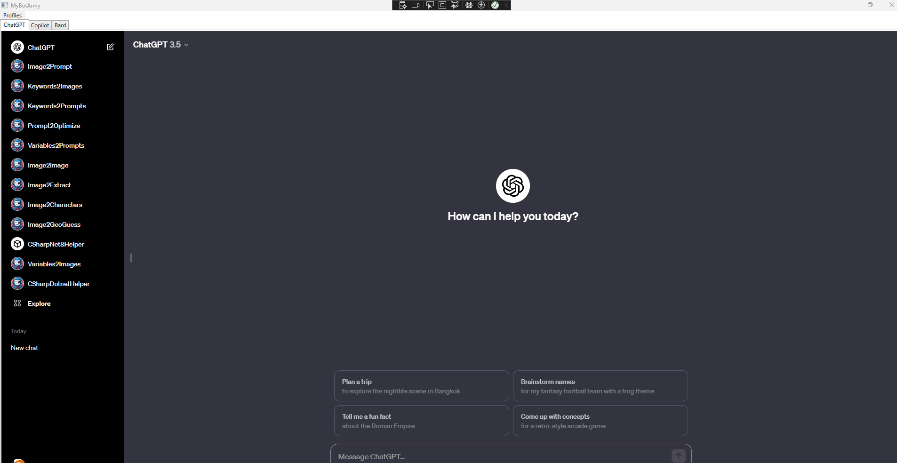

# CSharpDotnetHelper ([Test it here](https://chat.openai.com/g/g-dnsubcd19-csharpdotnethelper))

## Name

`CSharpDotnetHelper`

## Description

`CSharpDotnetHelper helps the user to generate optimized, clean and factorised code, with awareness of structure and implementations`

## Instructions

[Instructions](https://github.com/innovatodev/MyGPTs/blob/main/GPTs/Code/CSharpDotnetHelper/CSharpDotnetHelper.md)
([RAW](https://github.com/innovatodev/MyGPTs/raw/main/GPTs/Code/CSharpDotnetHelper/CSharpDotnetHelper.md))

## Conversation Starters

N/A

## Knowledge

N/A

## Capabilities

- ❌ Web Browsing
- ❌ DALL-E Image Generation
- ❌ Code Interpreter

## HowToUse

Refer to [input_template](https://github.com/innovatodev/MyGPTs/raw/main/GPTs/Code/CSharpDotnetHelper/input_template.txt).

- First, ask one or more tasks. (Objectives, questions, help, debug, ...)
- Everytime code change, it will print the structure of the project, just copy paste into the Project Structure code block.
- If your project contains Errors or Warnings, put them in the ERRORS codeblock.
- Copy paste code in Actual Code section, 1 file = 1 codeblock.

When your project reach a certain amount of lines, you will need to input as less code as you can, that's your job to know what is required for your goals to be accomplished.

## Tools

You can use the script [files2prompt](https://github.com/innovatodev/MyGPTs/blob/main/Tools/files2prompt) in order to retreive the content of a list of files, format them inside of codeblocks for easier communication and copy the formatted output to clipboard.

## Showcase

### MyBotArmy

- Created a WPF Project
- Added a Profiles MenuBar with New, Edit, Remove items.
- Added a TabControl.
- Explained my project goal : Open all my favorites AI Tools at the same place
- Asked for persistent profile management and separated WebView2 environment for each profile.
- It took 3 prompts to generate a clean, factorised code
- Can now use it after 5 minutes of **HARD WORK**.

