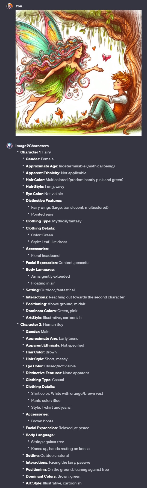

# Image2Characters ([Test it here](https://chat.openai.com/g/g-rlmTHFiDA-image2characters))

## Name

`Image2Characters`

## Description

`Image2Characters analyzes a character(s) focused image and creates a list based on the analysis.`

## Instructions

[Instructions](https://github.com/innovatodev/MyGPTs/blob/main/GPTs/Image/Image2Characters/Image2Characters.md)
([RAW](https://github.com/innovatodev/MyGPTs/raw/main/GPTs/Image/Image2Characters/Image2Characters.md))

## Conversation Starters

N/A

## Knowledge

N/A

## Capabilities

- ❌ Web Browsing
- ❌ DALL-E Image Generation
- ❌ Code Interpreter

## Showcase

