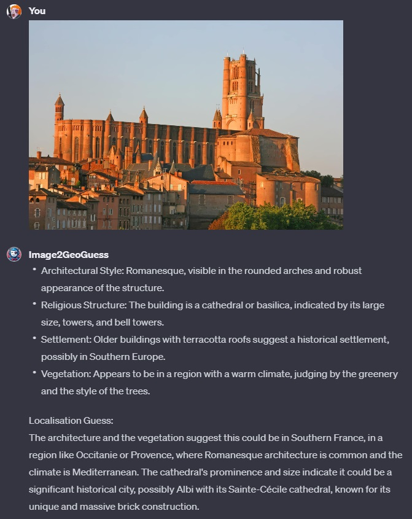

# Image2GeoGuess ([Test it here](https://chat.openai.com/g/g-meMRNzzxd-image2geoguess))

## Name

`Image2GeoGuess`

## Description

`Image2GeoGuess analyzes an image and try to guess where it was taken (GeoGuesser).`

## Instructions

[Instructions](https://github.com/innovatodev/MyGPTs/blob/main/GPTs/Image/Image2GeoGuess/Image2GeoGuess.md)
([RAW](https://github.com/innovatodev/MyGPTs/raw/main/GPTs/Image/Image2GeoGuess/Image2GeoGuess.md))

## Conversation Starters

N/A

## Knowledge

N/A

## Capabilities

- ❌ Web Browsing
- ❌ DALL-E Image Generation
- ❌ Code Interpreter

## Showcase

