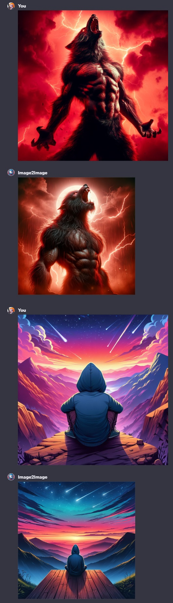

# Image2Image ([Test it here](https://chat.openai.com/g/g-88sXA0VZ0-image2image))

## Name

`Image2Image`

## Description

`Image2Image analyzes an image in order to build an image based on it.`

## Instructions

[Instructions](https://github.com/innovatodev/MyGPTs/blob/main/GPTs/Image/Image2Image/Instructions.md)
([RAW](https://github.com/innovatodev/MyGPTs/raw/main/GPTs/Image/Image2Image/Instructions.md))

## Conversation Starters

N/A

## Knowledge

N/A

## Capabilities

- ❌ Web Browsing
- ✔️ DALL-E Image Generation
- ❌ Code Interpreter

## Showcase

