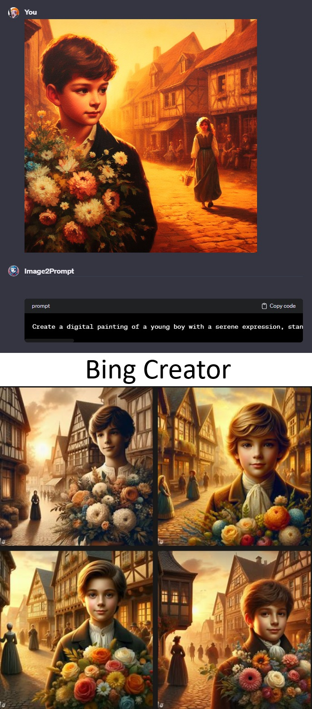

# Image2Prompt ([Test it here](https://chat.openai.com/g/g-It0q6vTQQ-image2prompt))

## Name

`Image2Prompt`

## Description

`Image2Prompt analyzes an image in order to build a prompt.`

## Instructions

[Instructions](https://github.com/innovatodev/MyGPTs/blob/main/GPTs/Image/Image2Prompt/Instructions.md)
([RAW](https://github.com/innovatodev/MyGPTs/raw/main/GPTs/Image/Image2Prompt/Instructions.md))

## Conversation Starters

N/A

## Knowledge

N/A

## Capabilities

- ❌ Web Browsing
- ❌ DALL-E Image Generation
- ❌ Code Interpreter

## Showcase

