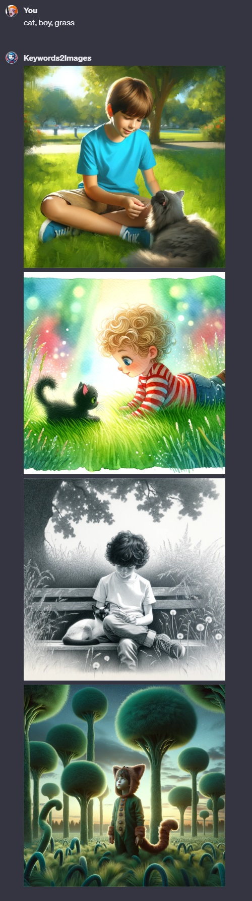

# Keywords2Images ([Test it here](https://chat.openai.com/g/g-up2Z303Iw-keywords2images))

## Name

`Keywords2Images`

## Description

`Keywords2Images generates images based on keywords list.`

## Instructions

[Instructions](https://github.com/innovatodev/MyGPTs/blob/main/GPTs/Image/Keywords2Images/Keywords2Images.md)
([RAW](https://github.com/innovatodev/MyGPTs/raw/main/GPTs/Image/Keywords2Images/Keywords2Images.md))

## Conversation Starters

- `cat, dog, sleeping`
- `cat, boy, grass`
- `valley, dusk, eagle`
- `stallion, cliff, sunset`

## Knowledge

N/A

## Capabilities

- ❌ Web Browsing
- ✔️ DALL-E Image Generation
- ❌ Code Interpreter

## Showcase

