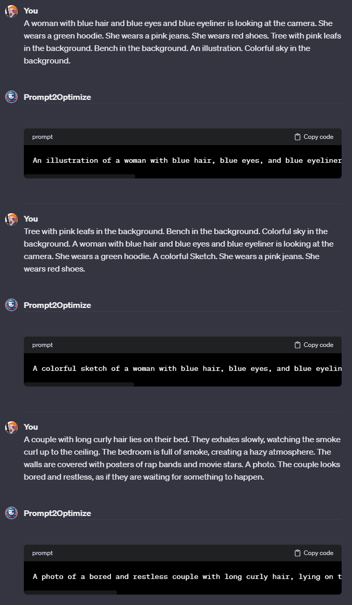

# Prompt2Optimize ([Test it here](https://chat.openai.com/g/g-YF2SqxdmL-prompt2optimize))

## Name

`Prompt2Optimize`

## Description

`Prompt2Optimize optimizes prompt provided by the user.`

## Instructions

[Instructions](https://github.com/innovatodev/MyGPTs/blob/main/GPTs/Image/Prompt2Optimize/Instructions.md)
([RAW](https://github.com/innovatodev/MyGPTs/raw/main/GPTs/Image/Prompt2Optimize/Instructions.md))

## Conversation Starters

- `A woman with blue hair and blue eyes and blue eyeliner is looking at the camera. She wears a green hoodie. She wears a pink jeans. She wears red shoes. Tree with pink leafs in the background. Bench in the background. An illustration. Colorful sky in the background.`
- `Tree with pink leafs in the background. Bench in the background. Colorful sky in the background. A woman with blue hair and blue eyes and blue eyeliner is looking at the camera. She wears a green hoodie. A colorful Sketch. She wears a pink jeans. She wears red shoes. `
- `A couple with long curly hair lies on their bed. They exhales slowly, watching the smoke curl up to the ceiling. The bedroom is full of smoke, creating a hazy atmosphere. The walls are covered with posters of rap bands and movie stars. A photo. The couple looks bored and restless, as if they are waiting for something to happen.`

## Knowledge

N/A

## Capabilities

- ❌ Web Browsing
- ❌ DALL-E Image Generation
- ❌ Code Interpreter
