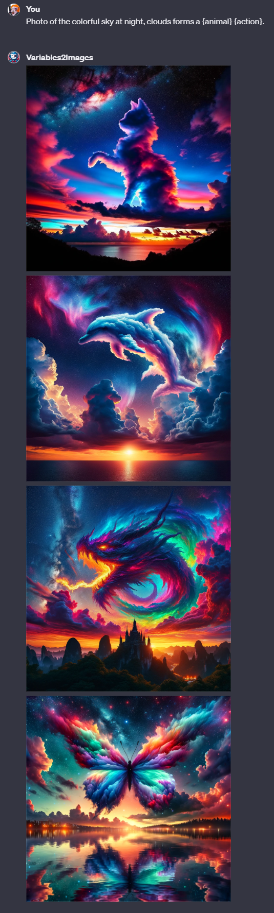

# Variables2Images ([Test it here](https://chat.openai.com/g/g-zMiJFVcFQ-variables2images))

## Name

`Variables2Images`

## Description

`Variables2Images generates images based on prompt containing {variables}.`

## Instructions

[Instructions](https://github.com/innovatodev/MyGPTs/blob/main/GPTs/Image/Variables2Images/Instructions.md)
([RAW](https://github.com/innovatodev/MyGPTs/raw/main/GPTs/Image/Variables2Images/Instructions.md))

## Conversation Starters

- `Photo of the colorful sky at night, clouds forms a {animal} {action}.`
- `Concept illustration of futuristic {color} {material} glasses with advanced {feature}. White background.`
- `Oil painting of a {mood} alien with exaggerated opened oval {eyecolor} eyes and {nervescolor} nerves {action} at the camera. White background.`
- `Portrait of a {ethnicity} woman with {haircolor} {hairstyle} and {eyecolor} eyes {expression} at the camera. She wears {clothes}. In the background {background}. {ambiance}.`

## Knowledge

N/A

## Capabilities

- ❌ Web Browsing
- ✔️ DALL-E Image Generation
- ❌ Code Interpreter
